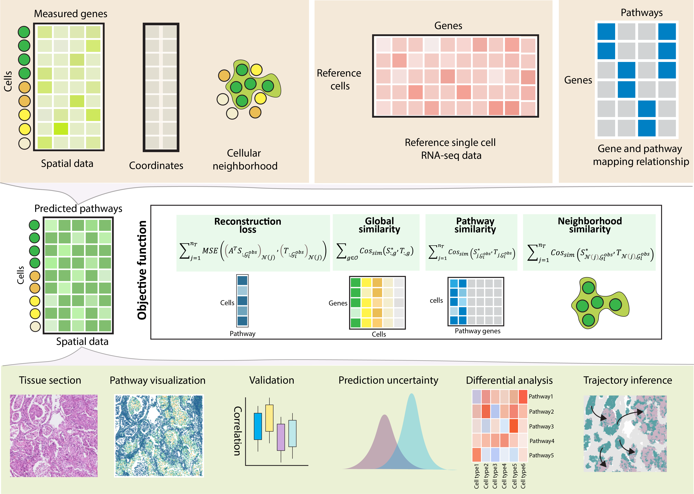

.. PASTA documentation master file, created by
   sphinx-quickstart on Thu Jun 19 13:37:42 2025.
   You can adapt this file completely to your liking, but it should at least
   contain the root `toctree` directive.

PASTA documentation
===================
Here we present PASTA (PAthway-oriented Spatial gene impuTAtaion), 
which is a tool to to imputate pathway expression for a spatial transcriptomic 
(ST) dataset referring to a single-cell RNA sequencing (scRNA-seq) dataset.

.. toctree::
   :maxdepth: 3
   :caption: Get started:

   my_files/quick_start

.. toctree::
   :maxdepth: 3
   :caption: Simulation:

   my_files/simulation_data

.. toctree::
   :maxdepth: 3
   :caption: Real data application:

   my_files/real_data